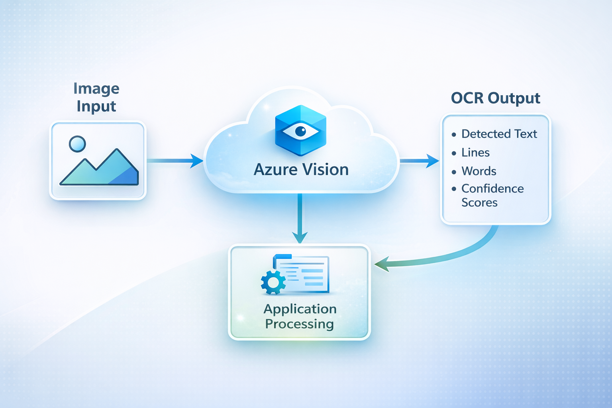
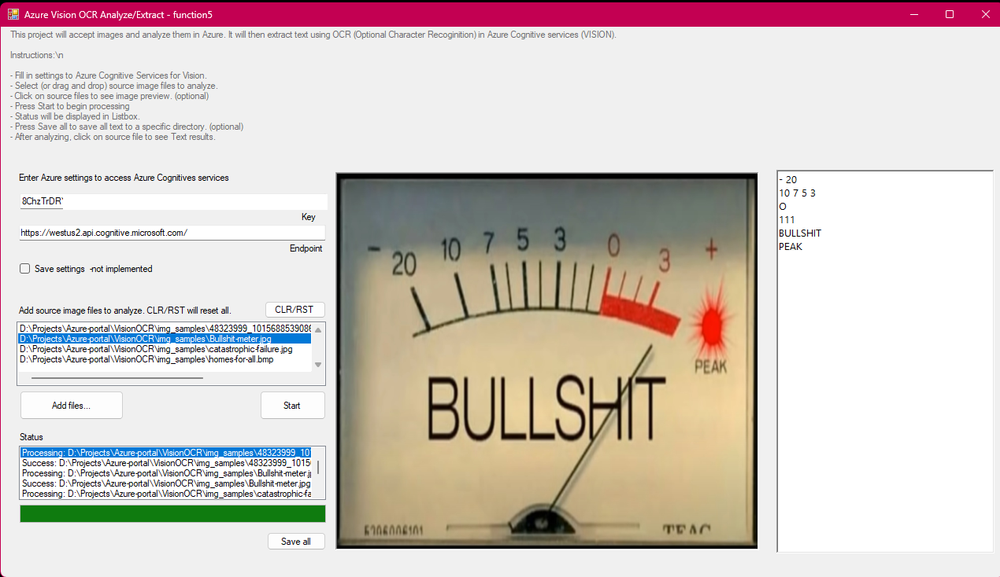
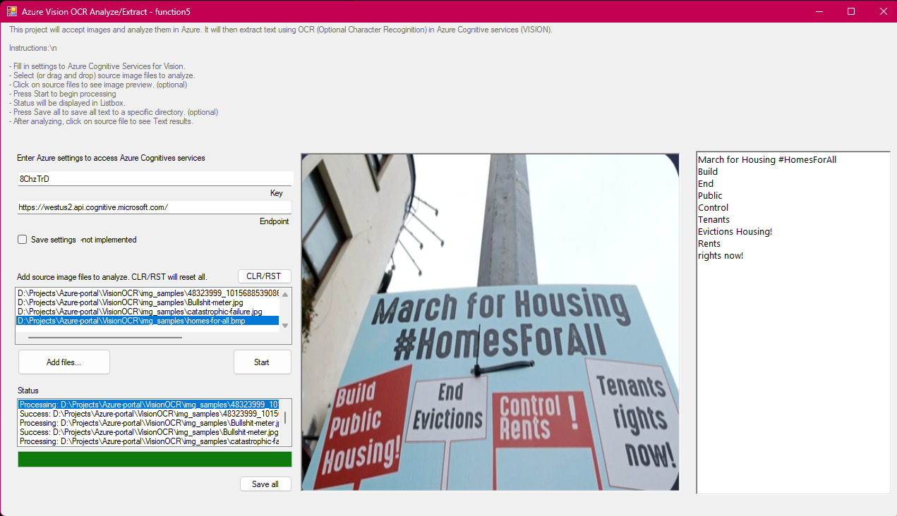
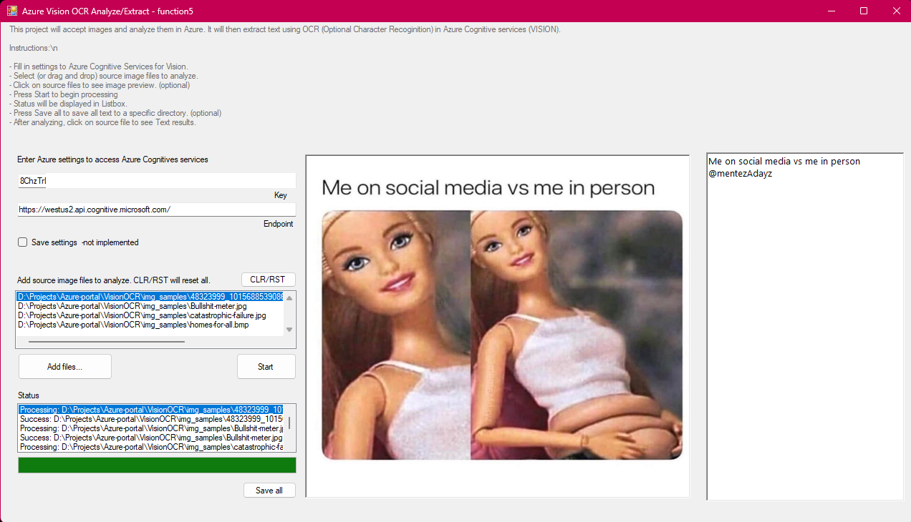

**Project:** VisionOCR 
**Codename:** function_5 
**Method:** Cloud 
**Lang/Dev Env:** C#, .NET 9 - WinForms - Visual Studio 2022.

# Introduction

A lightweight **Windows desktop OCR utility** built with **C# + WinForms (.NET 9)** that batch-processes images using **Azure AI Vision (Image Analysis) - Read (OCR)**.

This started as an AI-102 study side-project: I had screenshots and image “flash cards” where copy/paste wasn’t possible, and I wanted a faster way to convert them into clean text notes.

This project helped me understand how to integrate Azure's Vision services into a desktop application. To do that, I had to whip up a WinForms application to test the OCR capabilities. I'd do WPF, but I don't want to spend too much time on UI/UX design. WinForms is quick and easy for prototyping. WPF would've taken me three days to get something working. WinForms took me a couple of hours. Even that diverted me from study!

Azure Cognitive Vision services was much easier_ than **AI search and Language/Speech** services. My last project involved many: STT, TTS, Language Understanding, and AI Search. _That_ project (STT - function0) is located here: https://github.com/sorrynofocus/STT

### Who this project is for
- Developers learning Azure AI Vision OCR
- AI-102 exam preparation
- Quick desktop OCR utilities for screenshots and images

# Azure AI Vision (Image Analysis - OCR) WinForms Client

This project is a Windows Forms application for batch OCR processing using **Azure Cognitive Services - Vision (Image Analysis)**.  

I used the **ImageAnalysisClient** class to extract text from images using the **READ** feature. The raw output is then processed to clean up text and formatting issues. In this application example, I focused on images containing text, such as screenshots, labels, and signs. There's no support for PDFs, and Word documents. That's for Document Intelligence services that support such formats and layouts. The samples live in the `img_samples` sub folder.

### What it does

- Drag and drop **multiple images**
- Sends each image to **Azure AI Vision OCR (Read)**
- Extracts **raw OCR lines**
- Runs a small cleanup pipeline:
  - Removes common “junk UI lines” (configurable list in code)
  - Normalizes OCR whitespace (NBSP, mixed newlines, extra spaces)
  - Attempts basic paragraph reconstruction
- Displays the result in a RichTextBox
- “Save All” outputs text files per image

Supported image formats in this example: 

`JPEG, PNG, BMP, TIFF`

The Cognitive Vision OCR engine is meant for photos, screenshots, labels, street signs, UI captures, etc.

### Demo

_A quick demonstration how the example application works_. 

#### More Screen exhibits

_In this image exhibit you can see the meter text was extracted, along with text. No AI responsibility was included in this example_. 

_In this image exhibit you can see the text from various signs. The Vision service reads  in natural reading order (left to right, top to bottom), thus giving a mixed output. Unless specifically bounded in regions, which we could, it is not implemented in this example_. 

In this image exhibit, the meme photo is quite large. The Vision service was able to extract all text. In this example, I did not find the social handle it is referring to, but Vision Ai can pick up email addresses, URLs, phone numbers, hash tags, and social handles. It _may_ have hallucinated it. But, it did pick up the rest of the text quite well.

> Note:
> OCR confidence and entity detection may vary depending on image quality.
> The service may occasionally misinterpret or hallucinate symbols or handles.

### Build Requirements

Should you build this project locally, ensure you have the following prerequisites:

- Windows 11
- Visual Studio 2022 **or** .NET SDK installed
- Azure subscription
- An **Azure AI Vision / Computer Vision** resource (Image Analysis / OCR)

NuGet dependency:
- `Azure.AI.Vision.ImageAnalysis` (1.0.0)

  >  NOTE: There is a `auto-build.cmd` script included to help automate the build process. Just run it in the project root folder.

## Project Structure

- **README.md**  
  Project overview, setup instructions, and workflow explanation.

- **img/**  
  README screenshots and workflow diagrams.

- **img_samples/**  
  Sample images used for OCR testing.

- **ocr_function5/**  
  WinForms application source code.
  - `VisionOCRClient.cs` - Azure Vision OCR wrapper
  - `TextProcessProvider.cs` - OCR cleanup + paragraph reconstruction
  - `auto-build.cmd` - Publish helper

- **scripts/**  
  Azure setup and teardown automation.
  - `ocr_function_5_runbook_azure_setup.md` - **READ** this **first** for the services setup/teardown runbook
  - `000_boot_env.cmd` - Global environment bootstrap
  - `setup/` - Provision Azure resources
  - `teardown/` - Remove Azure resources

# Workflow Overview

## How the OCR pipeline works (TL;DR)

1. VisionOcrClient.ExtractRawLinesAsync() calls Azure Vision AnalyzeAsync(..., VisualFeatures.Read)

2. Raw line text is extracted from result.Read.Blocks[].Lines[]

  * TextProcessProvider applies:

  * RemoveDropPhraseLines(...)

  * NormalizeOCRText(...)

3. ConstructPotentialParagraphs(...)

4. Output is shown in the UI and saved to text files

## How the OCR pipeline works - detailed steps

> Legend: End User = person using the application (you?)

### 1. Provision Azure resources
* Use the provided setup scripts to create the required Azure resources.

* This includes the Azure AI Vision (Image Analysis) service, which provides the OCR capability.

### 2. Application authenticates using endpoint and key
* The end user enters _Endpoint_ and _API Key_ into the application.

* These credentials authenticate requests to Azure AI Vision.

> NOTE:
> The Endpoint must be the **resource endpoint**, for example:
> https://my-vision-resource.cognitiveservices.azure.com/
> Not the regional API root.

### 3. Images are sent to Azure for analysis
* When processing begins, each selected image is uploaded temporarily to Azure’s OCR endpoint.

* Azure does not store the images; they are processed in memory as part of the request.

### 4. Azure AI Vision performs OCR
* Azure’s Image Analysis “Read” feature extracts text lines from the image.

The service returns structured OCR results containing:
  * Detected text lines
  * Blocks
  * Bounding boxes (not used in this app, or in debug mode view)
  * Confidence scores (only viewable in debug mode!)
  

### 5. Application processes the OCR output
The raw OCR lines are cleaned using your custom pipeline:
  * Removes keyphrases (hard-coded in application. _See TextProcessProvider.DefaultDropPhrases_)
  * Normalize whitespace, newlines, tab, non-breaking spaces.
  * Reconstruct paragraphs
  
>  Note: Insane comments are included in source. I'm a huge  commenter as most are not. I feel good comments are for readability and comprehension. `if (annoyed) {sorry = true}`

### 6. End User reviews and saves results
* The cleaned OCR text is displayed in the UI. 
* End User can save all extracted text to files for later use.

# Azure Setup Instructions
In my last project, I gave a _really_ long explanation of how to create the many services. I ended up creating scripts for automation. Luckily, there is a couple of services we need to create. So, I created scripts to automate the process.

If you need to modify the scripts, feel free to do so. The scripts are located in the `scripts` folder. The only script you really need to modify is the boot loader -- that sets all environment variables for the scripts. Once that's done, all you need to do is pass in your subscription ID _OR_ set it as an environment variable `AZ_SUBSCRIPTION`. That easy! 

This project uses a **Service Principal** to authenticate automation scripts that deploy and tear down Azure resources.

> NOTE: Refer to the document `ocr_function_5_runbook_azure_setup.md` in the `scripts` folder for detailed setup and teardown instructions.

---

# Resources and References

Based on Azure SDK for .NET samples (for ImageAnalysisResult): 
https://github.com/Azure/azure-sdk-for-net/blob/main/sdk/vision/Azure.AI.Vision.ImageAnalysis/README.md 
https://github.com/Azure/azure-sdk-for-net/blob/main/sdk/vision/Azure.AI.Vision.ImageAnalysis/README.md#extract-text-from-an-image-file 
https://learn.microsoft.com/en-us/cpp/cognitive-services/vision/imageanalysis-imageanalysisresult 
https://learn.microsoft.com/en-us/azure/ai-services/computer-vision/how-to/call-read-api 
 
Cognitive Services - Vision (Image Analysis) documentation: 
https://learn.microsoft.com/en-us/azure/ai-services/computer-vision/overview 
https://learn.microsoft.com/en-us/azure/ai-services/computer-vision/overview-image-analysis 
https://learn.microsoft.com/en-us/azure/ai-services/computer-vision/concept-ocr 
https://github.com/Azure/azure-sdk-for-net/tree/main/sdk/vision/Azure.AI.Vision.ImageAnalysis 
 
Other issues like detecting list items, paragraph reconstruction, and whitespace normalization are referenced in below articles: 
https://learn.microsoft.com/en-us/azure/cognitive-services/computer-vision/overview-ocr 
Non-Breaking Space (U+00A0) Unicode Character 
https://unicode-explorer.com/c/00A0 
Trim characters 
https://learn.microsoft.com/en-us/dotnet/standard/io/file-path-formats#trim-characters 
 
Why Stop at Words? Unveiling the Bigger Picture through Line-Level OCR 
https://arxiv.org/html/2508.21693v1 
 
How OCR Works — Line Segmentation 
https://how-ocr-works.com/OCR/line-segmentation.html 
 
Sentence Boundary Detection in OCR Text 
https://aclanthology.org/W19-4006.pdf 
 
GCP Vision OCR Line Segmentation Example 
https://github.com/7codeRO/line-segmentation-gpc-vision-ocr 
 
Finally... 
https://regex101.com/ is your friend!

---

This document was assist-generated by CoPilot/Chat GiGPT for readability and ease of use.